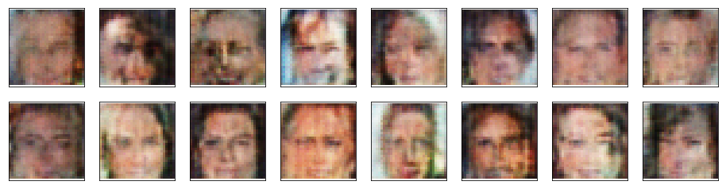
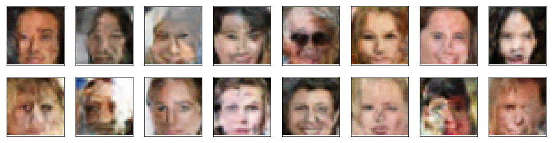
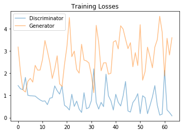

# Face Generation

In this project, I define and train a Deep Convolutional Generative Adversarial Networks (DCGAN) on a dataset of faces. The project's goal is to get a generator network to generate new images of faces that look as realistic as possible!  

Below are some samples of the generator output. After the fiest epoch, the generator got the placement of the eyes, nose and mouth right.   

*Generated images at 1st epoch*
 
 
By the 50th epoch, it enhanced the details of the face features (it even generated a face with sunglasses!). However, in most of the faces, one half of the face is good but the other half does not match.  

*Generated images at 50th epoch*
 
 
As can be seen in the plot below, the generator loss is still increasing, so training for more epochs might result in better generated faces.  
  
*Training loss*
