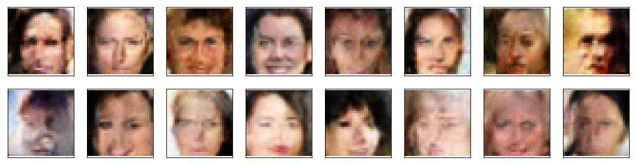

# Face Generation

In this project, I define and train a Deep Convolutional Generative Adversarial Networks (DCGAN) on a dataset of faces. The project's goal is to get a generator network to generate new images of faces that look as realistic as possible!  

Below are some samples of the generator output. After the fiest epoch, the generator got the placement of the eyes, nose and mouth right.   

*Generated images at 1st epoch*
 
 
By the 50th epoch, it enhanced the details of the face features.   

*Generated images at 50th epoch*
 
 
Adding more convolutional layers might enhance the images. Also, I can optimize the learning rate a little bit more, or change the optimizers to have better convergance of the generator and discriminator losses.  
  
*Training loss*
